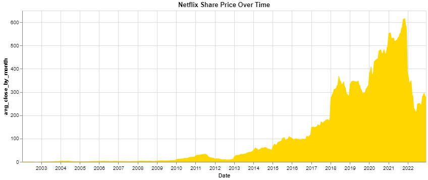

# Overview

I will be analysing a dataset that focuses on the S&P 500. I plan on working on this for two weeks to see what I can get done. This should include some exploration, visualizations, data cleaning, and machine learning. 

Used some data on the stock market to practice some data analysis and machine learning. (link to dataset below)

https://www.kaggle.com/datasets/paultimothymooney/stock-market-data?resource=download

I definitely learned from this experience. First off, I got some more exposure to using threads and looping through files
in a folder. I also learned more about isolating specific rows and learned about more packages like Swifter to run the apply function in parallel. Lastly, I was able to at least make a vanilla machine learning model to get try to guess the close of each row.

# Data Analysis Results

### What is the biggest difference in the low and high?

The biggest difference in high to low is 53156.0 from Berkshire Hathaway Inc.
The high was 468795.00 and the low was 415639.00
The date was 27-10-2022

### What is the largest difference by percentage?

The biggest difference by percent from high to low is 99.98492462247178 from Formcap Corp.
The high was 1.99 and the low was 0.0003
The date was 23-11-2020

### Netflix Share Price Graph

# Development Environment

I will be simply using Visual Studio Code as my text editor for this project. I'll save it on Github and I'll be using Python, Pandas, Altair, numpy, and Sklearn.  

# Github Link

https://github.com/blakedennett/DataAnalysis

# Future Work

Add some more visualizations

Improve my machine learning model